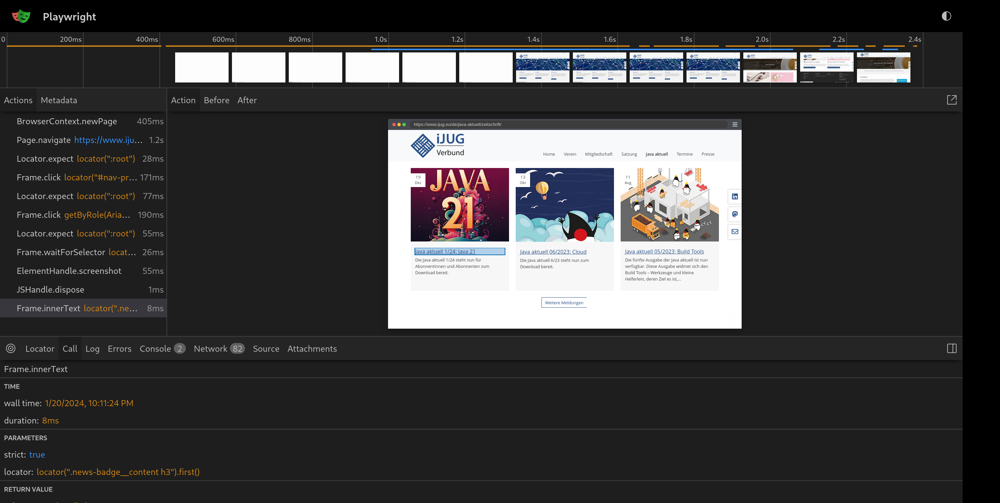
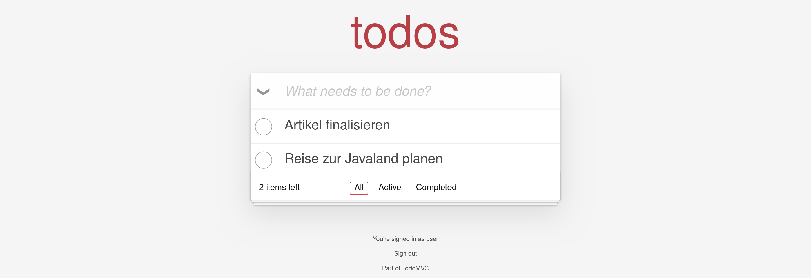

= End-2-End Testing mit Playwright Java
Frederik Hahne (adesso SE) <frederik.hahne@adesso.de>
v1.0, 2024-01-15: Rohentwurf

// Die folgenden Attribute darfst Du NICHT verändern:
:doctype: article
:table-caption: Tabelle
:listing-caption: Listing
:figure-caption: Abbildung
:source-language: java
:source-indent: no
:source-highlighter: rouge
:xrefstyle: short
:reproducible:

// Die folgenden Attribute darfst Du gerne anpassen:
:imagesdir: .

[abstract]
Während in letzter Zeit „Fullstack“ Entwicklung mit Java und Server-Side-Rendering wieder mehr
in Mode gekommen ist muss man für End-2-End Tests entweder auf Javascript-basierte Frameworks zurückgreifen
oder Selenium verwenden, mit allen Vor- und Nachteilen.
In diesem Artikel werden wir Playwright Java <<Playwright-Website>> als moderne Alternative zur
Browserautomatisierung und End-2-End Testing vorstellen,
sodass jeglicher Code mit Java geschrieben werden kann.

== Playwright Java im Überblick

Playwright ist eine von Microsoft entwickelte open-source Bibliothek zur Browserautomatisierung und End-2-End Testing.
Playwright unterstützt verschiedene Browser und übernimmt auch die Installation auf jeder unterstützten Platform (Windows, Mac, Linux).
Es existieren Implementierungen für TypeScript, JavaScript, Python, .NET und Java, wobei die Implementierung für Node.js die führende Variante ist.
Eine Reihe von Tools erleichtert sowohl das Erstellen von Test als auch die Fehlersuche.
Mithilfe des Codegen Tools können Klickpfade aufgezeichnet werden und in jeder unterstützten Sprache abgespeichert werden.
Der Inspector erlaubt es Test schrittweise zu durchlaufen und dabei z.B. Locator ändern.
Mit dem Trace-Viewer <<Playwright-Trace-Viewer>> kann man die Timeline eines ausgeführten Tests betrachten und somit im Fehlerfall das Problem identifizieren.
Playwright verspricht, dass "flaky" Tests der Vergangenheit angehören unter anderem durch Auto-wait <<Playwright-Auto-Wait>> und automatischen Retries, sodass keine künstlichen Timeouts oder Wartezeiten in Tests eingebaut werden müssen.
Neben Browsertests kann Playwright auch verwendet werden, um REST Apis zu testen, diesen Anwendungsfall werden wir hier nicht näher betrachten.
Es ist ebenfalls möglich Anfragen und Antworten abzufangen und zu verändern, um zum Beispiel das Verhalten der Anwendung im Fehlerfall zu prüfen.

== Playwright ohne Test Runner

Um Playwright in seinem Projekt zu verwenden, genügt es, `com.microsoft.playwright:playwright` als Abhängigkeit hinzuzufügen.
Im Beispiel mit Gradle (siehe xref:#listing.gradle-dependency[]), danach kann Playwright verwendet werden.
Um das Playwright Kommandozeilenwerkzeug direkt verwenden zu können definieren wir einen neuen Gradle Task, der mit `gradlew playwright --args="help"` aufgerufen werden kann.
In einem größeren Projekt ist es sinnvoll Unit-, Integration- und End-2-End Tests getrennt ausführen zu können.
Der neue Task `e2e` ist ein `Test` Task und führt nur Tests aus, die auf `E2E` enden.
Alternativ könnte man auch ein weiteres `SourceSet` definieren, aber die Namenskonvention ist ausreichend.

[[listing.gradle-dependency]]
[source,groovy]
.Playwright Integration in `build.gradle`
----
dependencies{
    testImplementation "com.microsoft.playwright:playwright:1.41.0"
}

tasks.register("playwright", JavaExec) {
	classpath sourceSets.test.runtimeClasspath
	mainClass = 'com.microsoft.playwright.CLI'
}

tasks.register("e2e", Test) {
	include '**/*E2E.*'
	exclude '**/*Spec.*', '**/*Test.*', '**/*IT.*'
	description 'Execute all E2E with playwright java.'
	group 'Verification'
	useJUnitPlatform()
}
----

Am schnellsten kann man Playwright ohne Test Runner verwenden (siehe xref:#listing.noTestRunner-1[]).
Die Playwright API besteht im Kern aus folgenden Elementen:

* `Playwright`
* `Browser`
* `Context`
* `Page`

`Playwright` ist der zentrale Einstiegspunkt.
Mit einem erstellen `Playwright` Objekt kann dann ein `Browser` gestartet werden.
Im Standard wird ein headless Browser gestartet.
Ein `Context` dient zur Isolation von verschiedenen Browser Sessions, sodass z.B. verschiedene Benutzer voneinander unabhängig simuliert werden können.
Das `Page` Objekt ist die elementare Klasse um mit dem Browser zu interagieren.
Auf einer `Page` können HTML Elemente selektiert werden, Assertions geprüft werden oder Screenshots der aktuellen Seite angelegt werden.
Als Benutzer muss man beachten, dass alle Objekte und Methoden der Playwright API nicht thread safe sind.
Wie man anhand von xref:#listing.noTestRunner-1[] erkennen kann gibt es keine synthetischen waits oder sleeps innerhalb des Skriptes um z.B. auf das vollständige Laden der Seite zu warten.
Playwright stellt sicher, dass z.B. die `click` Operation nur ausgeführt wird, wenn das Element auch klickbar ist.
Sollte es innerhalb einer konfigurierbaren Zeit nicht klickbar sein schlägt die Operation endgültig fehl <<Playwright-Auto-Wait>>.
Dadurch sind Playwright Test gut lesbar und verständlich.

Als Nutzer wird man am meisten mit dem `Locator` interagieren.
`Locator` dienen dazu Elemente auf der Webseite zu finden.
Playwright empfiehlt in der Regel sichtbare Attribute oder Elemente mit einer festen Semantik zu verwenden <<Playwright-Locators>>.
Ein Beispiel eines solchen Locators in xref:#listing.noTestRunner-1[] ist der `getByRole` Locator.
Die Verwendung des generischen Locators sollte im Idealfall vermieden werden, stattdessen sollten die spezifischen `getByXYZ` Methoden verwendet werden um Elemente zu selektieren, da diese besser wiederspiegeln wie Benutzer (oder auch Screenreader) die Seite wahrnehmen.

Der gesamte Code ist auf GitHub verfügbar <<Sample-Code>>.

[[listing.noTestRunner-1]]
[source,java]
.Playwright Skript um das Titelthema der aktuellen Java aktuell herauszufinden
----
public class PlaywrightOhneTestRunner {
    public static void main(String[] args) {
       try (Playwright playwright = Playwright.create();
                 Browser browser = playwright.firefox()
                         .launch(new BrowserType.LaunchOptions().setHeadless(true))) {
           BrowserContext context = browser.newContext();
           page.navigate("https://www.ijug.eu/de/home/");

           assertThat(page).hasTitle(Pattern.compile("Home: iJUG"));
           page.locator("#nav-primary").getByRole(AriaRole.LINK, new Locator.GetByRoleOptions().setName("Java aktuell")).click();
           assertThat(page).hasTitle("Java aktuell: iJUG");

           page.getByRole(AriaRole.LINK, new Page.GetByRoleOptions().setName("Weitere Informationen zum Magazin")).click();
           assertThat(page).hasTitle("Zeitschrift: iJUG");

           page.locator(".article.news-badge").first().screenshot(new Locator.ScreenshotOptions().setPath(Paths.get("build", "aktuelle-ausgabe.png")));
           String header = page.locator(".news-badge__content h3").first().innerText();
           System.out.println(header.split(":")[1].trim()); // --> Java aktuell 1/24: Java 21
       }
    }
}
----

=== Erstellen von Traces

Im Fall von fehlerhaften Tests ist es notwendig herauszufinden, warum der Test gescheitert ist.
Playwright bietet mit der Trace Funktion <<Playwright-Trace-Viewer>> eine Alternative zu Screenshots, Videos oder der manuellen Beobachtung des Testablaufs im Browser.

Um einen Tracedatei zu erzeugen, muss der Trace zunächst gestartet werden und am Ende gestoppt werden und die Datei gespeichert werden (siehe xref:#listing.noTestRunner-trace-2[]).
Die Datei kann nun entweder lokal mit der Playwright CLI oder im Browser via https://trace.playwright.dev/ geöffnet werden.
Um einen Trace lokal zu öffnen, muss der Parameter `show-trace` und der Pfad zur Tracedatei übergeben werden.
Im oberen Bereich sieht man die Zeitleiste des Tests, auf der linken Seite die einzelnen Schritte des Tests.
Man kann jeden einzelnen Schritt nachverfolgen und Fehler so nachvollziehen (Siehe xref:#bild.trace-view[]).

[[listing.noTestRunner-trace-2]]
[source,text]
.Erstellen einer Trace Datei
----
public class PlaywrightOhneTestRunner {
    public static void main(String[] args) {
       try (Playwright playwright = Playwright.create();
                 Browser browser = playwright.firefox()
                         .launch(new BrowserType.LaunchOptions().setHeadless(true))) {
            BrowserContext context = browser.newContext();
            context.tracing().start(new Tracing.StartOptions()
                .setScreenshots(true)
                .setSnapshots(true)
                .setSources(true));

            page.navigate("https://www.ijug.eu/de/home/");

            // ...
            context.tracing().stop(new Tracing.StopOptions()
                        .setPath(Paths.get("build/ohneRunner/trace.zip")));

       }
    }
}
----

.Ansicht eines Traces
[id="bild.trace-view"]

Playwright ohne Test Runner zu verwenden ist eine gute Option, um zum Beispiel innerhalb einer eigenen Anwendung Webseiten zu crawlen.
Um aber End-2-End Tests zu schreiben, bietet sich die Verwendung eines Test Runners wie JUnit oder TestNG an.
In folgenden Abschnitt werden uns die Verwendung mit JUnit 5 näher ansehen.

== Playwright mit JUnit

Zum Redaktionsschluss (Januar 2024) existiert noch keine offizielle Playwright JUnit Extension.
Es existiert eine Community Extensions <<Playwright-Junit-Community>>.
Der Autor arbeitet allerdings mit dem Playwright Team daran, die offizielle Extension zu entwickeln, daher sind hier keine Weiterentwicklungen zu erwarten.
Es existiert bereits eine erste Version der offiziellen Extension, diese wurde bisher aber noch nicht veröffentlicht <<Playwright-Junit-Code>>.

Als Beispiel verwenden wir eine angepasste Variante der in <<JavaAktuell>> erstellten TodoMVC Anwendung auf Basis von Spring Boot und Thymeleaf (siehe xref:#bild.todomvc[]).

.TodoMVC auf Basis von Spring Boot und Thymeleaf
[id="bild.todomvc"]

Generell ist die Integration von JUnit und Playwright relativ simpel <<Playwright-Junit>>.
Vor einem Test muss der Browser gestartet werden und nach einem Test wieder geschlossen werden, die einfachste Option ist die Verwendung von `@BeforeAll`, `@AfterAll`, `@BeforeEach` und `@AfterEach`.
In der mit `@BeforeAll` annotierten Methode wird der Browser gestartet, sodass dieser nur einmal pro Testklasse gestartet wird, da diese Operation relativ teuer ist.
Damit jede Testmethode einen eigenen Context verwendet, wird in der `@BeforeEach` annotierten Methode jeweils ein neuer Context erzeugt.
In den entsprechenden `@After` Methoden werden die erzeugten Objekte dann wieder geschlossen.
Wenn ein neuer `Context` erzeugt wird kann bei Bedarf das Tracing eingeschaltet werden.
Beim Schließen des `Context` kann die Tracedatei gespeichert werden.
Mithilfe der JUnit `TestInfo` kann man den Namen des Tests verwenden um, einen eindeutigen Dateinamen für die Tracedatei zu erzeugen.
Es bietet sich an diese Funktionen in eine eigene Klasse auszulagern, von der alle End-2-End-Test dann ableiten (xref:#listing.junit-config[]).

[[listing.junit-config]]
[source,java]
.Playwright JUnit Oberklasse
----
@TestInstance(TestInstance.Lifecycle.PER_CLASS)
class PlaywrightJUnitTestConfiguration {

    Playwright playwright;
    Browser browser;

    @BeforeAll
    void launchBrowser() {
        playwright = Playwright.create();
        browser = playwright.firefox().launch();
    }

    @AfterAll
    void closeBrowser() {
        playwright.close();
    }

    BrowserContext context;
    Page page;

    @BeforeEach
    void createContextAndPage() {
        context = browser.newContext();
        page = context.newPage();

        context.tracing().start(new Tracing.StartOptions()
                .setScreenshots(true)
                .setSnapshots(true)
                .setSources(true));
    }

    @AfterEach
    void closeContext(TestInfo testInfo) {
        String displayName = testInfo.getDisplayName();;

        context.tracing().stop(new Tracing.StopOptions()
                .setPath(Paths.get("build/ohneRunner/" + displayName +".zip")));
        context.close();
    }
}
----

Um Tests zu strukturieren oder Funktionen in verschiedenen Testmethoden wieder verwenden zu können, bietet es sich an sog. Page Object Models zu verwenden <<Playwright-Page-Objects>>.
Ein Page Object benötigt die `Page` und definiert alle relevanten `Locator` als Felder, die dann z.B. im Constructor definiert werden.
Erst zum Zeitpunkt der Verwendung versucht Playwright die Elemente im DOM zu finden (siehe xref:#listing.pom-todo[]).

[[listing.pom-todo]]
[source,java]
.Page Object Model der Todo Seite
----
public class TodoPage {

    private String baseUrl;
    private Page page;
    private Locator pageHeading;
    private Locator titleInput;
    private Locator todoListItems;
    private Locator completeAllTodosToggle;
    private Locator todoCount;
    private Locator clearCompleted;
    private Locator logoutButton;

    public TodoPage(Page page, String baseUrl) {
        this.baseUrl = baseUrl;
        this.page = page;

        pageHeading = page.getByRole(AriaRole.HEADING, new Page.GetByRoleOptions().setName("todos"));
        titleInput = page.getByPlaceholder("What needs to be done?");
        todoListItems = page.locator(".todo-list");
        completeAllTodosToggle = page.locator("#toggle-all");
        todoCount = page.locator(".todo-count");
        clearCompleted = page.locator(".clear-completed");
        logoutButton = page.getByRole(AriaRole.BUTTON, new Page.GetByRoleOptions().setName("Sign out"));
    }

    public void navigate() {
        page.navigate(baseUrl);
        PlaywrightAssertions.assertThat(pageHeading).isVisible();
    }

    public void createNewTodo(String title) {
        titleInput.fill(title);
        titleInput.press("Enter");

        PlaywrightAssertions.assertThat(todoListItems).isVisible();
    }

    public void completeAllTodos() {
        completeAllTodosToggle.click();

        Assertions.assertThat(todoCount.innerText()).isEqualTo("0 items left");
    }

    public void completeFirstTodo() {
        String todoCountBefore = todoCount.innerText();
        page.locator(".toggle").first().click();

        Assertions.assertThat(todoCount.innerText()).isNotEqualTo(todoCountBefore);
        clearCompleted.click();
    }

    public void logout() {
        logoutButton.click();
        PlaywrightAssertions.assertThat(page.getByRole(AriaRole.ALERT)).isVisible();
    }
}
----

Zu beachten ist hier, dass der `Browser` pro Testklasse erzeugt wird.
Für jede Testmethode wird ein neuer `BrowserContext` erzeugt.
In der Standardkonfiguration führt JUnit alle Tests nacheinander in einem Thread aus.
Da jede Testmethode durch einen eigenen `BrowserContext` isoliert ist können die Tests parallel ausgeführt werden.
Mit der Annotation `@TestInstance(TestInstance.Lifecycle.PER_CLASS)` teilt man JUnit mit, dass diese Klasse nur einmal für alle Testmethoden der abgeleiteten Klasse erstellt wird.
Um nun die Tests parallel auszuführen, muss JUnit noch konfiguriert werden (siehe. xref:#listing.junit-parallel-properties[]).

Ein abgeleiteter `@SpringBootTest` enthält dann keine Besonderheiten im Vergleich zum Beispiel zu einem Test, der RestAssured verwendet.
Vor jeder Testmethode wird ein Benutzer eingeloggt, jeder Test verwendet die in den Page-Objekten gekapselten Funktionen, sodass kaum Playwright spezifische Funktionen in den Tests selber verwendet werden (siehe xref:#listing.junit-config[]).

[[listing.junit-config]]
[source,java]
.Playwright Test mit JUnit
----
@SpringBootTest(webEnvironment = SpringBootTest.WebEnvironment.RANDOM_PORT)
public class PlaywrightJUnitE2E extends PlaywrightJUnitTestConfiguration {

    @LocalServerPort
    private int port;

    private String baseUrl() {
        return "localhost:%s".formatted(port);
    }

    @BeforeEach
    void beforeEach() {
        new LoginPage(page, baseUrl()).doLogin("user", "password");
    }

    @Test
    void createNewTodo() {
        TodoPage todoPage = new TodoPage(page, baseUrl());
        todoPage.navigate();
        todoPage.createNewTodo("Write article");
    }
}
----

[[listing.junit-parallel-properties]]
[source,text]
.Konfigurationsparameter um JUnit Tests parallel auszuführen
----
junit.jupiter.execution.parallel.enabled = true.
junit.jupiter.execution.parallel.mode.default = same_thread
junit.jupiter.execution.parallel.mode.classes.default = concurrent
junit.jupiter.execution.parallel.config.strategy=dynamic
junit.jupiter.execution.parallel.config.dynamic.factor=0.5
----

=== Ausblick

Mit der in Entwicklung befindlichen offiziellen JUnit Playwright Extension (<<Playwright-Junit-Code>>) reduziert sich die Konfiguration auf einige wenige Annotationen.
Außerdem wird es möglich sein, Traces nur für fehlerhafte Tests zu schreiben, ohne einen eigenen JUnit Test Listener schreiben zu müssen.
Die notwendigen Objekte der Playwright API können als Parameter injiziert werden, sodass keine gemeinsame Oberklasse mehr notwendig ist.
Zudem sorgt die Erweiterung für die korrekte, thread safe Erzeugung aller Playwright Objekte.
Die Verwendung wird sehr wahrscheinlich so aussehen wie in xref:#listing.junit-extensions[] dargestellt.
In der Klasse `DefaultPlaywrightOptions` kann die Konfiguration (z.B. Browser, Viewport) definiert werden.

[[listing.junit-extensions]]
[source,java]
.Vorschau auf die JUnit Playwright Extension
----
@SpringBootTest(webEnvironment = SpringBootTest.WebEnvironment.RANDOM_PORT)
@UsePlaywright(options = DefaultPlaywrightOptions.class)
public class PlaywrightJUnitExtensionsE2E {

    @LocalServerPort
    private int port;

    private String baseUrl() {
        return "localhost:%s".formatted(port);
    }

    @BeforeEach
    void beforeEach(BrowserContext context, Page page) {
        new LoginPage(page, baseUrl()).doLogin("user", "password");
        context.storageState(new BrowserContext.StorageStateOptions()
                .setPath(Paths.get("build/extension/state.json")));
    }

    @Test
    void createNewTodo(Page page) {
        TodoPage todoPage = new TodoPage(page, baseUrl());
        todoPage.navigate();
        todoPage.createNewTodo("Write article");
    }

    @Test
    void completeAllTodos(Page page) {
        TodoPage todoPage = new TodoPage(page, baseUrl());
        todoPage.navigate();
        todoPage.createNewTodo("Write article");
        todoPage.createNewTodo("Javaland");
        todoPage.completeAllTodos();
    }

    @Test
    void completeTodo(Page page) {
        TodoPage todoPage = new TodoPage(page, baseUrl());
        todoPage.navigate();
        todoPage.createNewTodo("Write article");
        todoPage.completeFirstTodo();
    }
}
----

== Fazit

Mit Playwright Java steht ein ausgereiftes Framework zur Browserautomatisierung und End-2-End Testing zur Verfügung.
Insbesondere in Projekten, in denen die Verwendung der node.js Variante nicht oder nur schwer möglich ist, ist Playwright Java eine moderne und nutzerfreundliche Alternative zu etablierten Tools wie Selenium.
Es hat sich im Projektalltag bei der adesso SE bereits bewährt.
Mit der kommenden JUnit Erweiterung wird die Verwendung in Java vereinfacht, sodass einer Verwendung nichts mehr im Wege stehen sollte.
Abseits von End-2-End Testing kann Playwright auch im Anwendungscode verwendet werden, um z.B. Webseiten zu crawlen, sofern keine API zur Verfügung steht.
Eine Integration in typische Buildpipelines ist problemlos möglich.
Neben einer offiziellen GitHub Action stellt das Playwright Team fertige Container bereit in denen Playwright ausgeführt werden kann.

Allerdings sollte man die Nutzung der node.js Variante nicht kategorisch ausschließen, da diese einige Features bietet, die vermutlich niemals in dieser Form mit JUnit erreicht werden können.
Zum einen ist der erzeugte Report sehr mächtig.
Man kann zum Beispiel beliebige Dateien anhängen und diese im Report betrachten, was sehr nützlich ist, wenn man zum Beispiel PDF Dokumente herunterlädt.
Außerdem werden Screenshots und Videos an den Report angehangen.
Visuelle Regressionstests sind integraler Bestandteil der node.js API.

[bibliography]
== Quellen

- [[[Playwright-Website,1]]] Playwright Website: link:https://playwright.dev/java//[]
- [[[JavaAktuell,2]]] Frederik Hahne (2023): Java aktuell 1/23, Moderne Frontends mit Thymeleaf, Spring Boot und HTMX
- [[[Playwright-Trace-Viewer,3]]] Playwright Trace-Viewer: link:https://playwright.dev/java/docs/trace-viewer-intro[]
- [[[Playwright-Auto-Wait,4]]] Auto-waiting Dokumentation: link:https://playwright.dev/java/docs/actionability[]
- [[[Playwright-Locators,5]]] Locator Dokumentation: link:https://playwright.dev/java/docs/locators[]
- [[[Sample-Code,6]]] Beispiel Code: link:https://github.com/atomfrede/java-aktuell-playwright[]
- [[[Playwright-Junit, 7]]] Playwright JUnit: link:https://github.com/atomfrede/java-aktuell-playwright[]
- [[[Playwright-Junit-Community, 8]]] Playwright JUnit Community Extension: link:https://github.com/atomfrede/java-aktuell-playwright[]
- [[[Playwright-Junit-Code, 9]]] Playwright JUnit Extension: link:https://github.com/microsoft/playwright-java/tree/ffe2bd4a966bf109c43eab4a9440d04c58fd4863/playwright/src/main/java/com/microsoft/playwright/junit[]
- [[[Playwright-Page-Objects, 10]]] Page Object Models: link:https://playwright.dev/java/docs/pom[]

== Über den Autoren/die Autorin

Frederik entwickelt seit 2007 vorwiegend Webanwendungen, er besitzt aber auch Erfahrung im Bau von Desktopanwendungen,
angefangen von JSP-basierten Anwendungen über Wicket bis hin zu Angular und Vue.

Seit 2022 bringt Frederik sein Wissen als Senior Software Engineer für die adesso SE am wunderschönen Standort Paderborn
in verschiedene, meist Java-basierte Projekte ein.
In der knappen freien Zeit organisiert er die Java User Group Paderborn, um
den Wissensaustausch, nicht nur zum Thema Java, in und um Paderborn zu fördern.

Er ist seit 2015 teil des JHipster Core Teams und kümmert sich dort insbesondere um den Gradle Support.